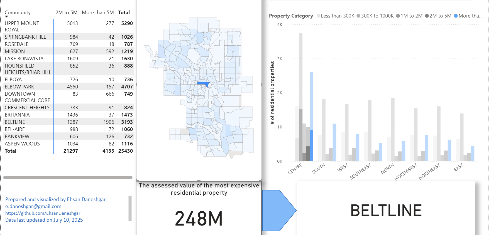

# 🏘 Calgary Residential Property Assessment Analysis (Power BI)

This Power BI dashboard presents a geographic and value-based analysis of Calgary's residential property assessments. It allows users to visually explore the most expensive communities and the distribution of property values across city sectors.

---

## 📊 Key Visuals & Features

### 1. **Top 15 Most Expensive Communities Table**
- A static table displaying the top 15 Calgary communities ranked by the number of properties assessed in the **$2M–$5M** and **over $5M** categories.
- Highlights luxury residential zones such as **Upper Mount Royal**, **Elbow Park**, and **Beltline**.
- This table is independent and does not interact with filters or visuals.

### 2. **City Sector Filter (Tile Format)**
- Selectable buttons for sectors:
  - **Centre**, **South**, **North**, **Northwest**, **Northeast**, **East**, **West**, and **Select All**
- Dynamically filters the **bar chart** and **map** to focus on selected regions.

### 3. **Bar Chart: Property Count by Sector & Value Range**
- **X-axis:** City Sectors  
- **Y-axis:** Number of Residential Properties  
- **Color-coded bars** represent value categories:
  - Less than 300K
  - 300K to 1M
  - 1M to 2M
  - 2M to 5M
  - More than 5M

### 4. **Property Category Filter (Dropdown)**
- Allows users to isolate a specific value category to analyze across the map and chart.

### 5. **Interactive Map of Calgary**
- Displays Calgary communities grouped by sector.
- Color-coded shading based on the number of high-value residential properties.
- Fully interactive and responds to both sector and value filters.

### 6. **Card Visuals**
- When a **community** is selected on the map:
  - **Card 1:** Shows the name of the selected community.
  - **Card 2:** Displays the **highest assessed residential property** value in that community.
  - A visual arrow guides attention from the community name to the value card.

### 7. **City-wide Highlight**
- A dedicated card shows that the **most expensive residential property in Calgary** is now valued at **$248 million**, based on the most recent assessment data.

---

## 🖼️ Sample Screenshots

| Dashboard Overview | Map & Chart Example |
|--------------------|---------------------|
|  |  |

---

## 📂 Project Files

| File | Description |
|------|-------------|
| `powerbi/Calgary_Property_Assessment.pbix` | Power BI report file |
| `images/` | Contains screenshots used in this README |

---

## 🔍 Data Source

This dashboard uses open data provided by the **City of Calgary Open Data Portal**.

- **[Total Property Assessed Value](https://data.calgary.ca/Government/Total-Property-Assessed-Value/dmd8-bmxh)** – Primary dataset for visualizations (updated regularly via API)

Additional datasets (CSV or API):
- City Planning Sectors
- Ward Boundaries
- Communities by Ward
- Historical Community Populations
- Residential Structure Assessments

---

## ⚙️ Tools Used

- Microsoft Power BI Desktop
- Power Query (M language)
- DAX (Data Analysis Expressions)
- City of Calgary Open Data APIs

---

## 📫 Contact

**Ehsan Daneshgar**  
📍 Calgary, AB  
📧 e.daneshgar@gmail.com  
🔗 [https://www.linkedin.com/in/ehsan-daneshgar/](https://www.linkedin.com/in/ehsan-daneshgar/)

---

## 💡 Future Enhancements

- (coming soon)

---

## 🧱 Notes

- The report reflects the most recent dataset available as of **July 10, 2025**  
- All values are shown in **Canadian dollars (CAD)**
- Intended for educational and analytical purposes  
- Relationships were created manually; **auto-detect relationships** was disabled to ensure accuracy and control

